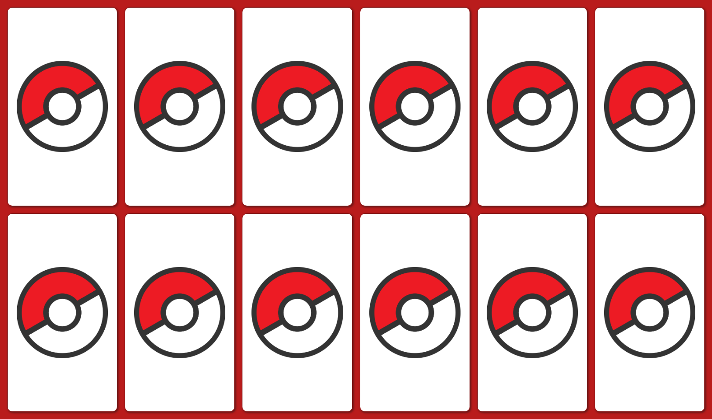

# 🧠 Jogo da Memória React | Memory Game React

[English](#English) | [Português](#Português)

---

## English

## 📸 Preview



---

## 🔗 Live Demo

🌐 Check the live demo at: [https://memory-pokemon.vercel.app](https://memory-pokemon.vercel.app)

---

## 📦 Technologies Used

- [React](https://reactjs.org/)
- [Vite](https://vitejs.dev/)
- [Tailwind CSS](https://tailwindcss.com/)
- HTML5 / CSS3 / JavaScript (ES6)

---

## ⚙️ Requirements

- Node.js (v16 or higher)
- npm or yarn

---

## How to run locally

### 🧩 Step 1: Clone the repository
```bash
git clone https://github.com/IzaDeveloper/memory-game-react.git
```

### 📁 Step 2: Navigate to the project folder
```bash
cd memory-game-react
```

### 📦 Step 3: Install dependencies
```bash
npm install
```

### ▶️ Step 4: Start the development server
```bash
npm run dev
```

---

👨‍💻 Author

Developed by [Izabelle](https://github.com/IzaDeveloper) 💻

## Português

## 📸 Preview


---

## 🔗 Demo online

🌐 Acesse a demo em: [https://memory-pokemon.vercel.app](https://memory-pokemon.vercel.app)

---

## 📦 Tecnologias usadas

- [React](https://reactjs.org/)
- [Vite](https://vitejs.dev/)
- [Tailwind CSS](https://tailwindcss.com/)
- HTML5 / CSS3 / JavaScript (ES6)

---

## ⚙️ Requisitos

- Node.js (v16 ou superior)
- npm ou yarn

---

## Como rodar localmente

### 🧩 Passo 1: Clonar o repositório
```bash
git clone https://github.com/IzaDeveloper/memory-game-react.git
```

### 📁 Passo 2: Acessar o diretório do projeto
```bash
cd memory-game-react
```

### 📦 Passo 3: Instalar as dependências
```bash
npm install
```

### ▶️ Passo 4: Rodar o projeto
```bash
npm run dev
```

---

👨‍💻Autor

Desenvolvido por [Izabelle](https://github.com/IzaDeveloper) 💻